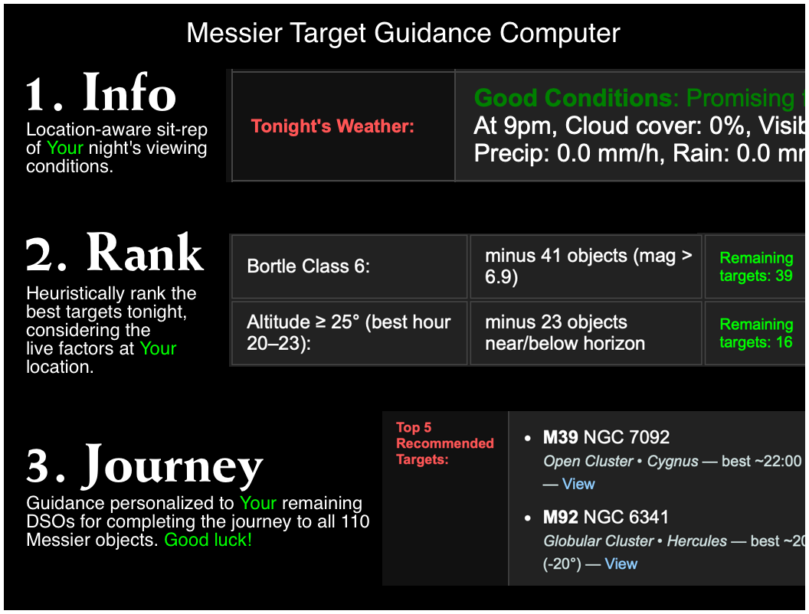

<br>
# MessierExplore  
_Free Astronomy Tools & Mini-Projects — explore the night sky with smart, beginner-friendly utilities._  

[]()
[]()
[]()
[]()
[]()


<br>

> Hi, my name is Mike. MessierExplore is a personal astronomy journey turned open toolkit — offering logbooks, sky guidance, and astrophotography utilities. Free, beginner-friendly, and built with Python + cloud tools.<br><br>
> There are many different avenues one could take in this topic, which makes for a very deep hobby/journey! I hope to cover several branches over time, but for now, the explorations here will be leaning towards the route of the classic dobsonian.<br><br>
> The suggested first quest in this journey is the classic exercise of the Messier Observing Program for logging and sketching the 110 Messier objects of the night sky, with log book and assisted guidance computer below.<br><br>

---

## Quick Links
- 📥 [Download / Use Tools](#tools-for-everyone)  
- 💻 [Peek at the Code](#code--repo-structure)  
- 🗺️ [Roadmap / What’s Next](#project-roadmap)
---

## Tools for Everyone

> One page, easy access. No install required.

### 1) Messier Observing Logbook (PDF)
<br>
- **What it is:** Printable logbook with the 110 Messier objects.
- **Get your personalized PDF Free:** https://logbook.messierexplore.com
- **Code:** Located in this repository as a python command-line script, and then as a web service; see files named logbook.
- **Features:** personalized cover page, tracking checklist, per-object log pages, sketch area, clean typography.

### 2) Messier Target Guidance Computer (Web App)
<br>
- 📝 **Inputs:** location, passphrase  
- 📊 **Outputs:** ranked list of suggested Messier targets + tonight’s conditions  
- 🌐 **Try it:** https://tcg.messierexplore.com

> 🚀 **Why Target Guidance Computer is Exciting**  
> The Target Guidance Computer is more than a Messier checklist – it’s a smart companion that combines astronomy math with real-world conditions.  
> ✨ Shows you what you haven’t logged yet  
> 🌙 Highlights which objects sit high and clear of the Moon  
> ☁️ Explains how tonight’s clouds, darkness, and sky quality affect your session
>   
> Minimalist design so you're up and running in seconds, with your approximate location, the tool personalizes your observing journey, tracks your “seen” list, and serves up the conditions and best targets for **today at 9 PM local time**.
> 💡 Lightweight, free, and built to grow – practical backend engineering powering human-friendly exploration of the night sky.

### 3) Dobsonian Astrophotography — Simple Stacking Utils (CLI, GUI.. tbd)
- **What it is:** Lightweight, beginner-friendly image stacking pipeline for Dobsonian + MFT DSLR. For myself I'm planning micro four thirds adapter to keep weight down. Dobsonian is not expected to be best choice for astrophotography, but like a manual transmission car, I'd like to explore what steps optimize the fun and results even if it might not outclass dedicated rigs and smartscopes.
- **Download:** (link to release binary or quickstart)

> Want something added? Open an issue with feature ideas ✨

---

## Code & Repo Structure
```text
├── assets/          # template pdfs employed by the logbook
├── data/            # messier object list, temporary sqlite db for playing (a production env would employ a cloud sql backend)
├── docs/            # license and manuals (work-in-progress)
├── output/          # the output folder of personalized logbooks if running logbook locally by commandline
├── services/        # web services of all tools (logbook, target guidance computer)
├── static/          # static images in a folder accessible by the web services
├── tests/           # pytest test suite
├── tools/           # cli version of tools as command line apps (logbook)
└── utils/           # shared logic for tools that come in web service and also commandline flavors 
```

---

## Project Roadmap

### Quest 1: Messier Observing Program
- [ ] YouTube Channel (journey to Astronomical League certification)  
- [ ] Messier Logbook Generator (Docker / GCS / Cloud Run)  
- [ ] Messier Target Guidance Computer (location-based, Cloud Run + SQL)  

### Quest 2: Dobsonian Astrophotography
- [ ] Image Stacking Pipeline Utilities (Dobsonian + MFT DSLR)  

---

## 📄 License
- Code: MIT (see [LICENSE](LICENSE))  
- Documentation/screenshots: CC BY 4.0 (see docs/LICENSE)  
- Logo: All Rights Reserved (contact for permission)  

---

⭐ If you like this project, give it a star and follow along — more tools are on the way!
